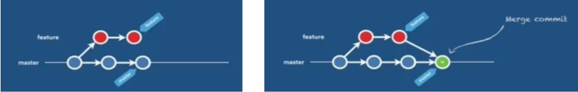
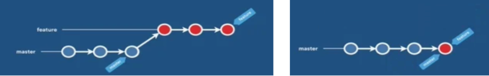
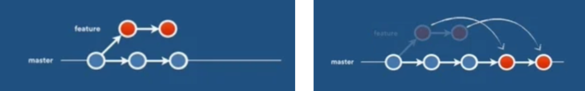
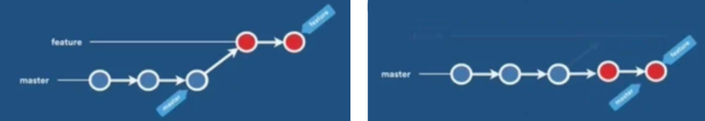

# Git

> Herramienta base del flujo de trabajo (Git Flow) en proyectos de software y MLOps.

**Git** es un sistema de control de versiones distribuido y de código abierto que permite rastrear los cambios en los archivos a lo largo del tiempo, facilitando la colaboración entre desarrolladores y la gestión del ciclo de vida del software.

Sus tres características clave son:

- **Distribuido**: cada persona tiene una copia completa del historial en su máquina.
- **Versionado**: cada cambio confirmado (*commit*) queda registrado y es recuperable.
- **Ramificable**: permite trabajar en paralelo mediante ramas sin afectar la versión estable.

---

## Tabla de contenidos

1. [Configuración inicial](#1-configuración-inicial)
2. [Ciclo básico: init, status, add y commit](#2-ciclo-básico-init-status-add-y-commit)
3. [Buenas prácticas de commits](#3-buenas-prácticas-de-commits)
4. [Deshacer y recuperar cambios](#4-deshacer-y-recuperar-cambios)
5. [Trabajo con ramas](#5-trabajo-con-ramas)
6. [Estrategias de fusión (merge y rebase)](#6-estrategias-de-fusión-merge-y-rebase)
7. [Versionado con tags](#7-versionado-con-tags)
8. [Apéndice: instalar Git en Windows](#apéndice-instalar-git-en-windows)

---

## 1. Configuración inicial

La configuración puede aplicarse a **nivel global** (para todo el equipo/usuario) o **local** (solo para el proyecto actual). Para configuración de proyecto, sustituye `--global` por `--local`.

```bash
git config --global <configuracion>
```

Las configuraciones más habituales son el **nombre** y el **correo**, usados para identificarte al hacer commits:

```bash
git config --global user.name "<Nombre>"
git config --global user.email "<correo electronico>"
git config --global init.defaultBranch main
```

### Alias: atajos para comandos frecuentes

Una configuración muy útil es crear alias para comandos largos que se repiten a menudo:

```bash
git config --global alias.<atajo> "<comando>"
```

Después basta con invocar el atajo:

```bash
git <atajo>
```

**Ejemplos típicos:**

```bash
git config --global alias.s "status -s -b"
git config --global alias.l "log --oneline --decorate --all --graph"
```

Con estos dos alias, `git s` muestra un estado compacto y `git l` dibuja el historial de ramas en forma de grafo.

---

## 2. Ciclo básico: init, status, add y commit

| Acción | Comando |
|---|---|
| Inicializar un repositorio | `git init` |
| Ver el estado del repositorio | `git status` |
| Añadir un fichero al *stage* | `git add <fichero>` |
| Añadir todos los cambios al *stage* | `git add .` |
| Confirmar los cambios | `git commit -m "<mensaje>"` |

### El área de *stage*

Git trabaja con tres zonas: el **directorio de trabajo** (tus archivos), el **stage** (cambios preparados) y el **repositorio** (cambios confirmados). El comando `add` mueve cambios al *stage* y `commit` los guarda como una versión del repositorio.

### Ignorar archivos con `.gitignore`

Para evitar que Git suba determinados ficheros o carpetas, se usa el archivo [`.gitignore`](../.gitignore) en la raíz del proyecto.

> [!TIP]
> El entorno virtual (`venv/`) no debe subirse al repositorio: es reproducible a partir de las dependencias. Añádelo al `.gitignore`:
> ```gitignore
> venv/
> ```

### Realizar un commit

Un *commit* genera un registro de cambios en el repositorio, guardando una versión de este:

```bash
git commit -m "<mensaje>"
```

Si quieres añadir una descripción más detallada, abre el editor con:

```bash
git commit -m "<mensaje>" --edit
```

Para modificar el mensaje del **último** commit:

```bash
git commit --amend
```

---

## 3. Buenas prácticas de commits

Las buenas prácticas recomiendan realizar commits **cortos y descriptivos**, siguiendo el estándar **Conventional Commits**.

### 3.1 Estándar *Conventional Commits*

Estructura del mensaje:

```
<tipo>(<alcance>): <mensaje corto>

<descripción opcional>
```

Tipos disponibles:

| Tipo | Uso |
|---|---|
| **feat** | Nueva funcionalidad |
| **fix** | Corrección de errores |
| **chore** | Tareas de mantenimiento (sin afectar al código) |
| **refactor** | Mejoras en el código sin cambiar funcionalidad |
| **perf** | Mejoras de rendimiento |
| **docs** | Documentación |
| **style** | Cambios de formato (espacios, comas, etc.) |
| **test** | Agregar/modificar pruebas |
| **ci** | Cambios en la configuración de integración continua |
| **build** | Cambios en el sistema de compilación o dependencias |
| **revert** | Deshacer un commit anterior |

**Ejemplo:**

```
feat(auth): añade validación de token JWT

Se incorpora la verificación de expiración del token
antes de permitir el acceso al endpoint protegido.
```

### 3.2 commitizen

**commitizen** es una herramienta que guía la escritura de commits conforme al estándar. Instalación:

```bash
poetry add install commitizen --group dev
```

En lugar de `git commit`, se usa:

```bash
cz commit
```

### 3.3 pre-commit

**pre-commit** valida, antes de confirmar, que los commits tengan el formato correcto y que el código siga las buenas prácticas. Instalación:

```bash
poetry add pre-commit --group dev
```

La validación se configura mediante *hooks* en el fichero [`.pre-commit-config.yaml`](../.pre-commit-config.yaml), y sus reglas asociadas en [`pyproject.toml`](../pyproject.toml).

> [!IMPORTANT]
> Tras instalar `pre-commit`, es **necesario** activarlo en el repositorio:
> ```bash
> pre-commit install
> ```

---

## 4. Deshacer y recuperar cambios

### 4.1 Reset — eliminar commits

Retrocede el puntero a una versión anterior.

```bash
git reset HEAD~<n>
```

> [!WARNING]
> El argumento `--hard` elimina también los cambios de los commits posteriores a la versión a la que regresas. **Úsalo con mucho cuidado**, ya que la pérdida de cambios no confirmados es irrecuperable.

### 4.2 Revert — volver a una versión antigua

A diferencia de `reset`, `revert` crea un **nuevo commit** que deshace los cambios, preservando el historial:

```bash
git revert HEAD~<n>
```

| | `reset` | `revert` |
|---|---|---|
| Reescribe historial | Sí | No |
| Crea nuevo commit | No | Sí |
| Recomendado en ramas compartidas | No | Sí |

### 4.3 Stash — guardar cambios temporalmente

Útil cuando necesitas priorizar otra tarea sin confirmar tu trabajo en curso.

| Acción | Comando |
|---|---|
| Guardar cambios | `git stash` |
| Listar los stash | `git stash list` |
| Restaurar cambios y borrar el stash | `git stash pop` |
| Borrar un stash | `git stash drop` |

> [!NOTE]
> `git stash drop` es necesario, por ejemplo, para limpiar un stash tras resolver conflictos que surgieron al aplicarlo.

---

## 5. Trabajo con ramas

Las ramas permiten desarrollar en paralelo sin afectar la versión estable.

| Acción | Comando |
|---|---|
| Crear una rama | `git branch <rama>` |
| Listar todas las ramas | `git branch -a` |
| Listar solo locales / solo remotas | `git branch -l` / `git branch -r` |
| Renombrar la rama actual | `git branch -m <nuevo nombre>` |
| Eliminar una rama (ya fusionada) | `git branch -d <rama>` |

### Cambiar de rama o moverse a un commit

```bash
git checkout <rama o id_hash del commit>
```

Para **crear** una rama y cambiarte a ella en un solo paso:

```bash
git checkout -b <nueva rama>
```

---

## 6. Estrategias de fusión (merge y rebase)

El **merge** combina los cambios de dos ramas. Existen distintas estrategias:

| Estrategia | Qué hace |
|---|---|
| **Merge Commit** | Crea un nuevo commit de fusión; conserva la rama auxiliar. |
| **Squash Merge** | Agrupa todos los commits de la rama auxiliar en uno solo al final de la rama principal; borra la auxiliar. |
| **Rebase and Merge** | Reubica todos los commits de la *feature* a continuación del último commit de la principal; borra la auxiliar. |
| **Fast Forward** | Avanza el puntero de la principal hasta la auxiliar; no genera commit de fusión. |






### 6.1 Merge

Generalmente se fusiona sobre `develop` o `master`, por lo que **primero** hay que situarse en la rama destino y luego ejecutar el merge:

```bash
git checkout develop
git merge <rama que quiero fusionar>
```

### 6.2 Rebase

El *rebase* mantiene un historial **limpio y lineal**. Si mientras desarrollabas una *feature* se hicieron cambios en `develop`, el rebase reubica el punto de partida de tu rama al último commit de `develop`. Debes ejecutarlo **desde la rama feature**:

```bash
git rebase develop
```

Si aparecen conflictos, resuélvelos y continúa:

```bash
git add <fichero con conflicto resuelto>
git rebase --continue
```

Para abortar y volver a la rama original sin cambios:

```bash
git rebase --abort
```

### 6.3 Rebase interactivo

Permite modificar commits anteriores: cambiar mensajes, unir (*squash*) commits, reordenarlos, etc.

```bash
git rebase -i HEAD~<n últimos commits>
```

> [!WARNING]
> El rebase reescribe el historial. Evita hacer rebase de commits que ya han sido compartidos/publicados en un repositorio remoto.

---

## 7. Versionado con tags

Los *tags* marcan puntos concretos del historial, normalmente versiones de release.

```bash
git tag <tag>
```

Para *tags* **anotados** (con autor, fecha y mensaje), usa `-a`:

```bash
git tag -a <tag> -m "<mensaje>"
```

### Versionado automático con commitizen

Configurado en [`pyproject.toml`](../pyproject.toml), *commitizen* permite versionar automáticamente el proyecto y el *package* en función de los *Conventional Commits*:

```bash
# Actualiza la versión (package y proyecto) y crea el tag automáticamente
cz bump
```

```bash
# Genera el CHANGELOG.md con todos los commits agrupados por versión
cz changelog
```

---

## Apéndice: instalar Git en Windows

📺 [Tutorial para instalar Git](https://www.youtube.com/watch?v=3FTficFKzME&ab_channel=AComputerGuru)

---

### Continúa con

➡️ **[GitHub](02_github.md)** — trabajo con repositorios remotos.
⬅️ **[Volver al Git Flow](00_git_flow.md)**
